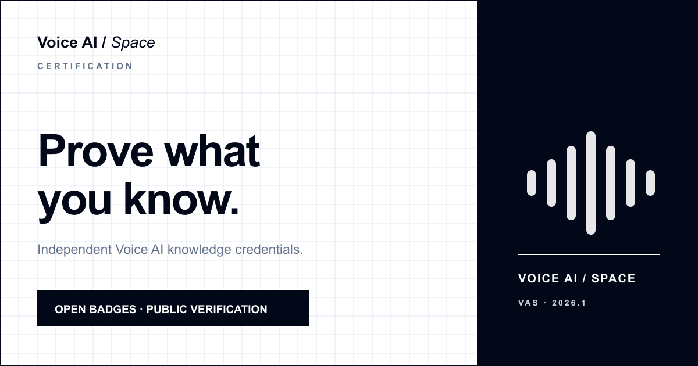
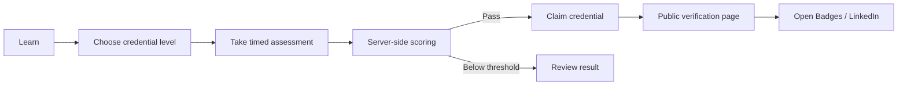
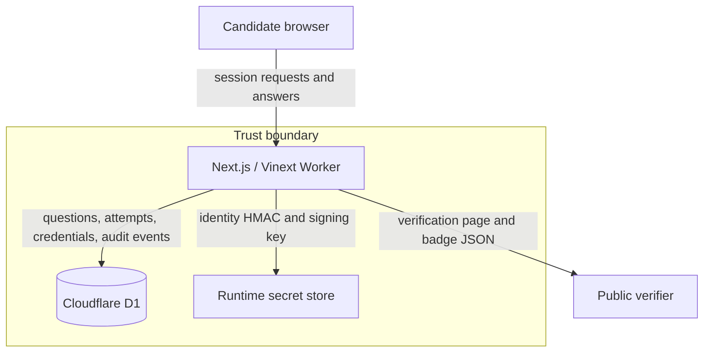

<p align="center">
  
</p>

<h1 align="center">Voice AI Space Certification</h1>

<p align="center">
  A secure Voice AI knowledge assessment and publicly verifiable credential platform.
</p>

<p align="center">
  <a href="https://credentials.voiceaispace.com/">Live platform</a>
  ·
  <a href="https://credentials.voiceaispace.com/learn">Knowledge library</a>
  ·
  <a href="https://credentials.voiceaispace.com/methodology">Methodology</a>
  ·
  <a href="https://credentials.voiceaispace.com/verify">Verify a credential</a>
</p>



## Overview

Voice AI Space Certification is an independent assessment platform for people
designing, building, and operating Voice AI systems. It combines:

- a public learning library with 135 searchable Voice AI concepts;
- a timed, versioned, server-scored assessment;
- a protected question-bank administration workflow;
- public credential verification and revocation;
- Open Badges 2.0 and 3.0 credential representations;
- accurate credential details for LinkedIn profiles.

The platform is issued by
[Voice AI Space](https://www.voiceaispace.com/) and is currently operating as a
public beta.

> Open Badges compatibility describes the credential data format. It does not
> imply accreditation, academic credit, government authorization, endorsement
> by LinkedIn, or 1EdTech conformance certification.

## Candidate journey



Correct answers and rationales never enter the browser bundle. The browser
receives only the questions and options selected for the current candidate
session.

## Credential ladder

| Level | Credential | Type | Capability represented |
| --- | --- | --- | --- |
| Beginner | Voice AI Fundamentals | Knowledge Badge | Core vocabulary, components, and concepts |
| Foundations | Voice AI Foundations | Knowledge Certificate | Applied understanding across the five domains |
| Intermediate | Voice AI Practitioner | Professional Certification | Evaluation of implementation trade-offs and production scenarios |
| Expert | Voice AI Architect | Professional Certification | Production-grade and responsible system design judgment |

Each credential is earned independently and remains valid for two years unless
revoked.

## Assessment standard

| Property | Current standard |
| --- | --- |
| Version | `VAS-2026.1` |
| Questions | 25 |
| Duration | 35 minutes |
| Pass threshold | 80% |
| Distinction | 90% |
| Attempt limit | 2 attempts per level in a rolling 30-day window |
| Validity | 730 days |

Every credential-level assessment—including Voice AI Fundamentals, Voice AI
Foundations, Voice AI Practitioner, and Voice AI Architect—contains 25
questions. Those 25 questions are distributed across the five knowledge
domains as follows:

1. Voice AI Fundamentals domain — 5 questions
2. Real-Time Architecture & Pipelines — 6 questions
3. LLM + Voice Orchestration — 6 questions
4. Voice UX & Conversation Design — 4 questions
5. Enterprise, Compliance & Verticals — 4 questions

The source of truth for these values is
[`lib/policy.ts`](lib/policy.ts).

## Main capabilities

### Learning

- Public `/learn` knowledge library
- Search and domain filtering
- 135 concepts spanning the full Voice AI ecosystem
- No certification answers or production questions in public source

### Assessment

- Candidate-bound sessions
- Cryptographically random question selection
- Timed attempts with resumable browser state
- Server-side answer validation and scoring
- Domain-level result breakdown
- Pass, distinction, expiry, and attempt-window enforcement

### Credentials

- Stable public credential IDs
- Human-readable verification pages
- Two-year expiry and administrator-controlled revocation
- Open Badges 2.0 hosted assertions
- RS256-signed Open Badges 3.0 Verifiable Credentials
- Public JSON Web Key Set for independent signature verification
- Print/PDF and LinkedIn guidance

### Administration

- Administrator allowlist
- Private question-bank dashboard
- Validated JSON imports
- Draft and approved item states
- Independent-reviewer requirement for approved items
- Audit events for imports, attempts, issuance, and revocation

## Technology

| Layer | Technology |
| --- | --- |
| Application | Next.js 16, React 19, TypeScript |
| Build/runtime | Vinext, Vite, Cloudflare Workers |
| Database | Cloudflare D1 |
| Credential signing | `jose`, RS256, JSON Web Keys |
| Hosting | OpenAI Sites / Cloudflare |
| Tests | Node.js test runner plus production build validation |

## Architecture



The browser is treated as untrusted. D1 is authoritative for question content,
attempts, submitted answers, results, credentials, revocation state, and audit
events.

## Repository structure

```text
app/                    Next.js routes, pages, and API handlers
components/             Assessment, verification, learning, and admin UI
docs/                   Credential policy, security model, launch checklist
drizzle/                D1 schema migration
lib/                    Policy, exam, credential, crypto, and badge services
public/                 Badge artwork, favicon, and social preview
scripts/                Deterministic badge and social-card generators
tests/                  Platform, security, content, and packaging checks
worker/                 Cloudflare Worker entrypoint
.openai/hosting.json    Sites project and logical resource bindings
```

## Local development

### Requirements

- Node.js 22.13 or newer
- npm
- A local Cloudflare-compatible runtime supplied by the project dependencies

### Install and run

```bash
git clone https://github.com/ThibaultMardinli/voice-ai-knowledge-test.git
cd voice-ai-knowledge-test
npm install
cp .env.example .dev.vars
npm run dev
```

Open the local URL printed by the development server.

The public pages can run without a production question bank. A complete local
assessment requires the D1 migration and sufficient approved questions for the
selected level and blueprint.

### Useful commands

```bash
npm run dev             # Start the local development server
npm run build           # Create the production Worker build
npm test                # Build and run all automated tests
npm run assets:badges   # Regenerate credential badge artwork
npm run assets:og       # Regenerate the social preview image
```

## Runtime configuration

Copy [`.env.example`](.env.example) to `.dev.vars` for local development.
Production values belong in the hosting platform’s runtime variable and secret
store, never in Git.

| Variable | Purpose | Secret |
| --- | --- | --- |
| `PUBLIC_BASE_URL` | Canonical issuer and verification origin | No |
| `IDENTITY_HMAC_SECRET` | Non-reversible candidate identity derivation | Yes |
| `OB3_PRIVATE_KEY` | RS256 credential-signing private key | Yes |
| `OB3_PUBLIC_JWK` | Public verification key | No |
| `OB3_KEY_ID` | Stable signing-key identifier | No |
| `ISSUANCE_ENABLED` | Enables credential issuance | No |
| `ASSESSMENT_ENABLED` | Enables formal assessment starts | No |
| `PRACTICE_MODE` | Enables the public beta/practice flow | No |
| `DEPLOYMENT_STAGE` | Controls beta, preview, or production presentation | No |
| `ADMIN_EMAILS` | Comma-separated administrator allowlist | Sensitive |
| `QUESTION_BANK_IMPORT_SECRET` | Temporary bearer secret for controlled imports | Yes |

Generate cryptographically strong values for every secret. Never reuse
development keys in production.

## Database

The initial migration is
[`drizzle/0000_initial.sql`](drizzle/0000_initial.sql). It creates:

- `question_bank`
- `exam_sessions`
- `exam_answers`
- `credentials`
- `audit_events`

The Sites build packages this migration and binds the application to the
logical `DB` D1 resource declared in `.openai/hosting.json`.

## Public routes

| Route | Purpose |
| --- | --- |
| `/` | Credential path and assessment standard |
| `/learn` | Public Voice AI knowledge library |
| `/assessment` | Assessment start and active session flow |
| `/results/{session-id}` | Candidate result |
| `/claim/{session-id}` | Passing-candidate credential claim |
| `/credentials/{credential-id}` | Public credential verification |
| `/criteria/{level}` | Published credential criteria |
| `/verify` | Credential lookup |
| `/methodology` | Public assessment methodology |
| `/privacy` | Privacy notice |
| `/admin/questions` | Protected question-bank administration |

## Open Badges endpoints

| Endpoint | Format |
| --- | --- |
| `/api/open-badges/v2/issuer` | Open Badges 2.0 issuer profile |
| `/api/open-badges/v2/badge-classes/{level}` | Open Badges 2.0 BadgeClass |
| `/api/open-badges/v2/assertions/{credential-id}` | Hosted Open Badges 2.0 assertion |
| `/api/open-badges/v3/issuer` | Open Badges 3.0 issuer profile |
| `/api/open-badges/v3/achievements/{level}` | Open Badges 3.0 Achievement |
| `/api/open-badges/v3/credentials/{credential-id}` | Signed Open Badges 3.0 VC JWT |
| `/api/open-badges/v3/jwks` | Public signing keys |

## Security model

Important implemented controls include:

- server-side session ownership and scoring;
- rate-limited attempts by identity, level, and rolling window;
- correct-answer storage only in private D1;
- keyed HMAC candidate identifiers;
- salted Open Badges 2.0 recipient hashes;
- RS256 Open Badges 3.0 signatures;
- administrator-only revocation and question management;
- independent review requirements for approved questions;
- audit logging for security-relevant operations;
- restrictive response security headers.

Read [`docs/security-model.md`](docs/security-model.md) for trust boundaries,
operational requirements, and residual risks.

## Question-bank governance

Production questions, answer keys, rationales, and import files must never be
committed to this repository.

An approved item requires:

- exactly four distinct options and one correct option;
- a rationale and authoritative source notes;
- a stable private key, version, level, and domain;
- an identified author;
- a different reviewer and a valid review timestamp.

See [`docs/credential-policy.md`](docs/credential-policy.md) and
[`docs/launch-checklist.md`](docs/launch-checklist.md) before enabling formal
issuance.

## Deployment

The project is deployed through OpenAI Sites using the configuration in
`.openai/hosting.json`. A release consists of:

1. a successful production build and test run;
2. an exact source commit pushed to the configured repository;
3. a packaged Vinext Worker build and D1 migration;
4. a saved Sites version;
5. deployment with production runtime variables and secrets.

The canonical public origin is
[credentials.voiceaispace.com](https://credentials.voiceaispace.com/).

## Contributing

1. Create a focused branch.
2. Keep production questions and all secrets out of source.
3. Run `npm test`.
4. Document policy, schema, or endpoint changes.
5. Open a pull request with the user impact and validation evidence.

## Governance and support

- Issuer: [Voice AI Space](https://www.voiceaispace.com/)
- LinkedIn: [Voice AI Space](https://www.linkedin.com/company/voice-ai-space)
- Contact: [tbot@voiceaispace.com](mailto:tbot@voiceaispace.com)

The credential attests to performance on a versioned knowledge assessment. It
does not attest to employment history, supervised professional experience,
regulated authorization, academic credit, or guaranteed job performance.
